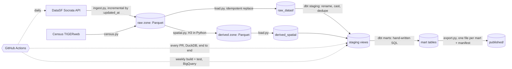

# sf-data-warehouse

Analytics engineering project built on San Francisco open data: automated
Python ingestion, a Parquet raw zone, DuckDB and BigQuery warehouses fed from
it, dbt modelling with tests and documentation, an H3 spatial layer, and
scheduled CI. Built to be read, so the engineering decisions are documented in
`docs/decisions/` and summarised below.

Total cost: zero. Every part runs on a free tier, and the whole pipeline runs
on a fresh clone with no cloud account at all.

## The question it answers

**"How many 311 cases are inside this neighborhood, and is that a lot?"**

Both halves are the point. The first resolves through integer H3 cell
predicates with no geometry engine at query time. The second needs a
denominator, because a raw count per neighborhood is mostly a map of where
people live: 311 cases rank Mission first by count and Golden Gate Park first
per resident, and only one of those is interesting.

## Architecture



Five steps, separate on purpose (ADR-4, ADR-5). Only the BigQuery targets need
credentials:

```
make ingest    APIs      -> raw zone          network, no credentials
make spatial   raw zone  -> derived zone      no network, no credentials
make load      both      -> DuckDB            no network, no credentials
make build     dbt run + test                 no network, no credentials
make publish   warehouse -> published/        no network, no credentials
```

**There is one zone at a time, and it is never two.** A run reads and writes
whichever zone its environment names: `data/raw` and `data/derived` by default,
which is every fresh clone and all of CI, or `gs://<bucket>/...` with
`RAW_ZONE_URI` and `DERIVED_ZONE_URI` set (ADR-9). A remote run does not also
write the local directories, so they are not a cache or a mirror of the bucket.
Point at the zone you mean.

`make all` runs the first four in order. Running `ingest` without `spatial`
leaves the new rows with no geography, so `make build` checks that the derived
zone is not behind the raw zone before it runs anything.

`make ci-build` runs all of it from committed fixtures with no network at all.

## Data sources

Seven datasets in three tiers (ADR-7, narrowed by ADR-10). Every one of them
is spatial, which is a claim rather than an accident: the project answers one
question about where things are, and a dataset that does not carry a location
dilutes that rather than broadening it.

| Dataset | Tier | Why it is here |
|---|---|---|
| 311 cases | core | High volume, daily updates, a real record lifecycle. The anchor. |
| Building permits | core | Messy money and unit fields, and it joins to 311 on geography and time. |
| Registered business locations | core | Both a subject and a denominator: the only source that says where commercial activity is. At 365k rows it is also the H3 stress test. |
| Analysis neighborhoods | reference | The 41 polygons every spatial mart joins to. |
| Supervisor districts | reference | The 11 polygons, 2022 boundaries. |
| Census block groups | reference | 681 polygons with 2020 population. The denominator. |
| Film locations | demoted | The pipeline canary and the demo mart, because a portfolio should have one dataset that is fun. |

## Stack and decisions

- **ELT over ETL.** Python lands raw API records as Parquet with every column
  a STRING and zero transformation. All typing, renaming and deduplication
  happens in dbt, where it is versioned, tested and documented. Raw is never
  mutated. (ADR-1)
- **Parquet is the record; the warehouses are derived.** DuckDB is canonical
  and BigQuery is a supported secondary target fed from the same files, so a
  fresh clone builds with no Google account and losing any one vendor loses
  nothing. (ADR-1, ADR-4)
- **Incremental ingestion, ordered by a total key.** Each run resumes from the
  newest `:updated_at` in the zone. Paging orders by `(:updated_at, :id)`,
  because DataSF bulk-refreshes these datasets and ties of several thousand
  rows across a page boundary were silently losing records. (ADR-4)
- **H3 computed in Python, not by either engine.** BigQuery has no H3 support
  of any kind, so an H3 call in a model cannot compile on both targets. Cells
  are computed once and stored as BIGINTs that both engines read, which is a
  stronger guarantee than matching dialects: the two warehouses cannot
  disagree, because neither derives the answer. (ADR-5)
- **No geometry at query time.** Covering cells are the coarse filter and the
  exact point-in-polygon refinement runs once, at precompute, against only the
  two or three boundaries a cell touches. Membership is exact, and a test
  asserts it against an independently computed oracle with no threshold to
  relax. (ADR-6)
- **Every count mart has a normalised companion.** Rates per 1000 residents,
  per 1000 housing units, per 1000 businesses and per square kilometre, which
  disagree with each other on purpose. Bayview Hunters Point is 4th by 311
  count and 18th per resident.
- **Testing and observability.** 148 dbt tests on every build, including
  accepted ranges on coordinates, relationship tests from every point table to
  the neighborhood dimension, a population reconciliation check, and three
  spatial assertions comparing the H3 machinery against exact geometry.
  `mart_pipeline_freshness` reports staleness and the per-source coordinate
  drop rate. The hand-written point-in-polygon and spherical area code has its
  own pytest suite (`make test-python`), which is the one thing here not tested
  through SQL: it pins the areas against a closed form and states the contract
  for a point that lands exactly on an edge or a vertex, where a ray-casting
  test has no right answer and consistency is the guarantee instead.
- **CI runs the whole thing.** Every pull request builds the raw zone from
  fixtures, runs the spatial precompute against real polygons, loads, builds,
  tests, publishes, then drops the warehouse and rebuilds it to prove the
  zones are the source of truth. It also compiles every model against
  BigQuery, which needs no credentials. The geometry unit tests gate that
  end-to-end job rather than running beside it: they take a tenth of a second
  and they cover the code the whole spatial layer rests on, so a failure there
  should not arrive alongside five minutes of downstream noise.

## What it does not do

Stated plainly, because a portfolio project that overstates itself is worse
than a small one that does not.

- **It does not carry city spending at all.** The budget dataset was ingested
  and modelled for a while, and was cut under PLAN-5 along with its mart. The
  join anyone actually wants, spending against 311 demand, needs a crosswalk
  between budget department codes and the 311 `agency_responsible` field, two
  independently maintained taxonomies with no reason to agree; building it is a
  project in itself. A budget mart that stayed inside one taxonomy did not
  answer that question and was the only non-spatial thing here, so it went.
- **The BigQuery build is run by hand, not by every PR.** It has run: first on
  2026-07-31, which found four cross-engine defects that compiling could not,
  again on 2026-08-01 against external tables over GCS, and on 2026-08-05,
  which found a fifth. What CI does on every PR is compile every model for
  BigQuery without credentials, which proves the SQL is valid there rather than
  that it returns the same rows. `scripts/parity-check.py` proves the second,
  on demand: `make parity-check` row for row, and `make parity-columns` on the
  column sets, which is what the fifth defect turned out to need. A green
  `make check` says nothing about BigQuery or about the bucket zones, on
  purpose, so that a fork pull request needs no credentials.
- **`make publish` is still manual, but no longer because it has to be.** It
  has run against a real bucket once, on 2026-08-01, when one publish was 2,280
  objects against a free tier of 5,000 Class A operations a month and 17 MB took
  6 minutes 39, because the cost is per object. The cause was two marts
  partitioned by month over a range starting in 1849, not the data volume.
  ADR-12 made every published mart a single file: 7 objects and 3.0 MB, so a
  daily publish would use 210 operations a month. It is manual now because
  nobody has decided to schedule it. Note the published paths changed, which
  breaks a consumer of that one upload; `MANIFEST_VERSION` is 2.
- **The derived zone knows what built it.** `_manifest.json` carries a hash over
  the source of every module that computes the zone, so `make check-derived`
  can say "this zone was built by code that no longer exists" rather than only
  "this zone is behind" (ADR-11). The practical consequence is that editing any
  of those modules, comment included, means the next `make spatial` rebuilds
  everything. That is deliberate; the alternative fails silently.
- **Population is the 2020 Decennial count**, not a current estimate, because
  the ACS API now requires a key and ADR-1 keeps credentials off the ingestion
  path. Every per-capita rate divides by an April 2020 denominator.
- **No rates per parcel or per street mile.** Neither dataset is in scope.

## Repo layout

```
ingestion/          registry loader, raw zone, TIGERweb transport, H3
                    precompute, loader. The registry itself is
                    vars.pipeline_sources in dbt/dbt_project.yml, one list
                    that both dbt and dataset_registry.py read.
                    the precompute is spatial.py (entry point, schemas) over
                    h3_points.py, boundaries.py and population.py, with
                    derived_state.py holding the code stamp and deciding what a
                    re-run has to recompute
publish/            export.py: marts to Parquet with a manifest
dbt/                models/staging, models/intermediate, models/marts, macros, tests
docs/decisions/     ADRs. Start here for why anything is the way it is.
docs/plans/         forward-looking intent
docs/dev-notes/     append-only session log, including what broke
tests/              pytest over the geometry code and the dataset registry;
                    fixtures/ is committed JSON so CI runs with no network
.github/workflows/  ci.yml (every PR), ingest.yml (daily), dbt.yml (weekly)
CLAUDE.md           canonical context. Authoritative on architecture.
SETUP.md            step-by-step reproduction guide
```

## Roadmap

PLAN-5 closed on 2026-08-05: the project was narrowed rather than grown, to
seven datasets, two H3 resolutions, one dataset registry, direct pytest
coverage on the geometry code, and a derived zone that records the code that
built it and rebuilds only what has moved. See `docs/README.md` for the plan
index and status.

PLAN-7 closed later the same day. Both of its checks exist: `make check-runs`
reconciles the raw zone's run manifests against the Parquet beside them, in CI
and credential-free, and `make parity-columns` asserts the BigQuery
external-table column sets against the zone.

What is open:

- **The context pack (PLAN-6), and it is most of the way there.** A
  model-agnostic artifact that lets any capable LLM query this warehouse
  correctly and tells it what it must refuse to answer.
  `docs/specs/context-pack.md` is the contract and was written before the
  generator; `make context-pack` produces the DuckDB pack, with 20 refusals
  sorted into three classes, 6 mandatory disclosures and 6 examples that are
  executed at generation time or the build fails. What is left is CI, the
  packs for the other two targets, and the ADR that closes the plan.
- Per-boundary-set H3 resolution. The measurements in ADR-6 show block groups
  want a finer one and supervisor districts would be fine with a coarser one.
