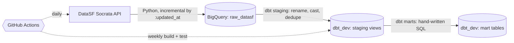

# sf-data-warehouse

Analytics engineering project built on San Francisco
open data: automated Python ingestion, a BigQuery warehouse, dbt
modeling with tests and documentation, and scheduled CI. Built to be
read, so the engineering decisions are documented below.

## Architecture



## Data sources

| Dataset | Why it is here |
|---|---|
| 311 cases | High volume, updates daily, real operational data with lifecycle (open to closed), ideal for incremental loading and time-based analysis |
| Building permits | Messy real-world strings and money fields, good cleaning practice |
| City budget | Enables spend vs demand analysis when joined against 311 volume |
| Film locations | Every movie and TV show shot in SF with locations and trivia, because a portfolio should have at least one dataset that is fun to demo |

## Stack and decisions

- **ELT over ETL.** Python lands raw API records into BigQuery with
  every column as a STRING and zero transformation. All typing,
  renaming, and deduplication happens in dbt, where it is versioned,
  tested, and documented. Raw data is never mutated.
- **Incremental ingestion.** Each run reads the max Socrata
  `:updated_at` already in the warehouse and fetches only newer rows, so
  the daily job moves thousands of rows, not millions. Raw tables are
  append-only; staging models deduplicate to the latest version of each
  record with a window function.
- **Two-layer dbt design.** Staging views (one per source table) handle
  shape; mart tables handle meaning. Marts only reference staging, never
  raw.
- **Testing and observability.** Schema tests (unique, not_null,
  accepted_values) run on every build, source freshness checks flag a
  stalled pipeline, and `dbt docs` generates a browsable lineage graph
  and data dictionary.
- **CI on GitHub Actions.** Ingestion runs daily, `dbt build` (models
  plus tests) runs weekly, both against the same env-var-driven
  configuration used locally. Credentials live only in repo secrets.
- **Cost: $0.** BigQuery free tier, Socrata open API, GitHub Actions
  free for public repos.

## Repo layout

```
ingestion/          Python ingestion (datasets.py registry, ingest.py loader)
dbt/                dbt project: models/staging, models/marts, tests, docs
.github/workflows/  ingest.yml (daily), dbt.yml (weekly build + test)
SETUP.md            step-by-step reproduction guide
```

## Roadmap

- Marts for case resolution times, permit activity by neighborhood, and
  year-over-year budget change by department
- The headline analysis: does city spending track 311 demand by
  department and district
- Incremental dbt materializations once mart volumes justify it
- A BI layer (Looker Studio) on top of the marts
