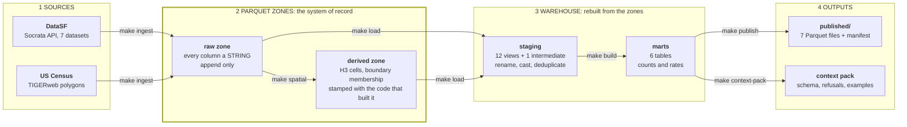
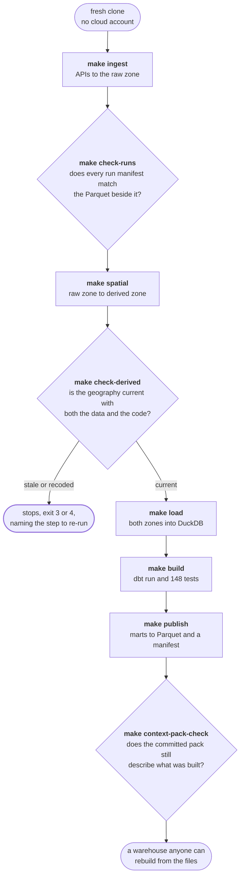

# sf-data-warehouse

**Seven public San Francisco datasets, ingested, geocoded and modelled into an
analytics warehouse that anyone can rebuild from scratch.**

Python ingestion into a Parquet raw zone, an H3 spatial layer computed outside
the query engine, dbt modelling under 148 tests, scheduled CI, a published
Parquet export, and a generated contract that lets a language model query the
result correctly. Every design decision is recorded in `docs/decisions/`.

| | |
|---|---|
| **Runs on a fresh clone** | `make setup && make ci-build`. No cloud account, no credentials, no cost. |
| **Tested** | 148 dbt tests plus a Python suite over the geometry code, on every pull request. |
| **Reproducible** | CI drops the warehouse and rebuilds it from Parquet, to prove the files are the source of truth. |
| **Two engines** | Every model compiles on DuckDB and BigQuery. Running both found five defects that compiling could not. |
| **LLM-ready** | A generated context pack tells a model what this warehouse holds and what it must refuse to answer. |
| **Documented** | 18 numbered architecture decisions, 11 still binding, 9 closed plans, and an append-only session log. |

---

## Start here

Three event datasets (311 service requests, building permits, business
registrations) are aggregated by place and month into two tables you query
directly:

| To ask | Query |
|---|---|
| How many 311 cases of a given type were opened in the Mission last March, and how does that compare to other neighborhoods? | `mart_activity_by_neighborhood` |
| Where in the city is permit activity concentrated, at roughly 460m resolution? | `mart_activity_by_h3` |

Both carry event counts and rates. `dim_neighborhood` and
`dim_supervisor_district` hold the denominators behind those rates: population,
housing units, business count and land area. Film locations get their own mart,
and `mart_pipeline_freshness` reports on the pipeline rather than the city.

**Counts and rates answer different questions, so both are always present.**
Rank the 41 neighborhoods by 311 volume and Mission is first. Rank them per
resident and Golden Gate Park is first, on a population of 458. Bayview Hunters
Point is 4th by count and 18th per resident. A raw count mostly tracks
population, so every count column here has a rate column beside it.

**Geography is precomputed, not queried.** Each record's neighborhood, district
and H3 cells are stored as columns, written once by a Python step that resolves
533k points against 733 boundaries. Queries then do integer comparisons. No
model uses a geometry type or a spatial function, which is what lets the same
SQL run on both DuckDB and BigQuery.

Its limits are listed in [What it does not do](#what-it-does-not-do) and
encoded as refusals in the context pack.

---

## System map

Four layers. Boxes are what exists; edge labels are the command that produces
it. The Parquet zones are the system of record, and everything downstream of
them can be rebuilt from them.



Two engines read those same files. DuckDB is canonical and needs nothing;
BigQuery is a secondary target and needs a Google account. Either can be
dropped and rebuilt from the zones.

**A run uses one zone, never two.** It reads and writes whichever zone its
environment names: `data/raw` and `data/derived` by default, which covers every
fresh clone and all of CI, or `gs://<bucket>/...` when `RAW_ZONE_URI` and
`DERIVED_ZONE_URI` are set. A run against the bucket does not also write the
local directories, so those hold whatever the last local run left there
(ADR-9).

---

## How you run it

Rectangles are commands you run. Diamonds are checks that stop the pipeline,
and each was added after the failure it catches had already occurred once.



| Command | Does | Needs network | Needs credentials |
|---|---|---|---|
| `make ingest` | APIs to raw zone, resuming from the newest record already held | yes | no |
| `make spatial` | raw zone to derived zone. 23s full, 0.3s when nothing moved | no | no |
| `make load` | both zones to DuckDB, idempotent replace | no | no |
| `make build` | dbt run and test, in dependency order | no | no |
| `make publish` | warehouse to `published/`, one file per mart | no | no |
| `make ci-build` | all of the above from committed fixtures, isolated | no | no |
| `make check` | everything CI runs on a pull request | no | no |

`make all` runs the first four in order. `make setup` builds the venv and
installs the git hooks. Only the BigQuery targets need a Google account, and
nothing in the pull request gate does.

---

## Repo layout

```
ingestion/          registry loader, raw zone, TIGERweb transport, H3
                    precompute, loader. The registry itself is
                    vars.pipeline_sources in dbt/dbt_project.yml, one list
                    that both dbt and dataset_registry.py read.
                    The precompute is spatial.py (entry point, schemas) over
                    h3_points.py, boundaries.py and population.py, with
                    derived_state.py holding the code stamp and deciding what a
                    re-run has to recompute.
publish/            export.py: marts to Parquet with a manifest
dbt/                models/staging, models/intermediate, models/marts, macros, tests
tools/context_pack/ the pack generator, verified against docs/specs/context-pack.md
context-pack/       the generated packs. The one generated thing here that IS
                    committed, so a model change shows up as a diff in the PR
docs/decisions/     ADRs. Start here for why anything is the way it is.
docs/plans/         forward-looking intent
docs/dev-notes/     append-only session log, including what broke
tests/              pytest over the geometry code, the dataset registry, the
                    retention proof and the pack generator; fixtures/ is
                    committed JSON so CI runs with no network
.github/workflows/  ci.yml (every PR), ingest.yml (daily), dbt.yml (weekly),
                    retention.yml (weekly): proves what the raw zone can spare
                    and fails when it is over 1 GB. It never deletes anything.
CLAUDE.md           canonical context. Authoritative on architecture.
SETUP.md            step-by-step reproduction guide
```

---

## Problems that were not obvious up front

Six issues found while building this, and what changed because of each.
Detailed reasoning is in `docs/decisions/`.

**A count per area mostly tracks population.** Ranking neighborhoods by 311
volume looks like analysis but largely reproduces the population map. Every
count mart carries rate columns against four denominators (ADR-10).

**The two engines share no geography function.** BigQuery has no H3 support, so
an H3 call in a model cannot compile on both targets. Cells are computed once
in Python and stored as BIGINTs, so both engines read the same value rather
than deriving their own (ADR-5).

**Exact point-in-polygon is expensive.** 533k points against 733 boundaries,
with no geometry engine permitted at query time. Covering cells filter first,
then exact refinement runs against only the two or three boundaries each cell
touches. A test compares the result against an independently computed oracle
(ADR-6).

**Paging a bulk-refreshed API drops rows silently.** Ordering by an update
timestamp alone breaks when thousands of rows share one timestamp across a page
boundary. Paging orders by the total key `(:updated_at, :id)`, and every run's
manifest is reconciled against the Parquet it wrote (ADR-18).

**An append-only zone grows without limit.** Storage was the only free-tier
limit this project could realistically reach. The prune deletes a partition
only when a later one provably holds every key at values no older, and refuses
what it cannot prove. The proof runs weekly; the deletion is manual (ADR-18).

**A language model given a schema answers questions the data cannot support.**
311 volume reads like a measure of street conditions. It measures who reports.
The context pack carries 20 refusals, 6 mandatory disclosures and 6 executed
examples, checked against the warehouse on every pull request (ADR-13).

---

## Checks, and when they run

| Check | When | Credentials |
|---|---|---|
| Credential leak scan, blocks the merge | every pull request | no |
| pytest over the point-in-polygon and area code | every pull request, gating the end-to-end job | no |
| Build the raw zone from committed fixtures, end to end | every pull request | no |
| Reconcile run manifests against the Parquet | every pull request | no |
| 148 dbt tests: grain, not null, accepted ranges, relationships, 3 spatial assertions | every pull request | no |
| Drop the warehouse and rebuild it from the zones alone | every pull request | no |
| Compile every model as BigQuery SQL | every pull request | no |
| Context pack drift check, both packs | every pull request | no |
| ruff, sqlfluff, and a check that the two pinned copies of ruff agree | every pull request | no |
| Ingest from DataSF into the bucket | daily, 09:17 UTC | yes |
| Full `dbt build` against BigQuery | weekly, Mondays | yes |
| Raw zone retention proof. Reports, deletes nothing, fails over 1 GB | weekly, Mondays | yes |
| Row-for-row and column-set parity across both engines | by hand | yes |

The pull request gate needs no credentials so that it runs on forks, where
repository secrets are unavailable. The tradeoff is that a green `make check`
covers neither BigQuery nor the bucket zones. `make build-bigquery` and
`make parity-check` cover those, by hand.

---

## The context pack

A generated, engine-agnostic document that gives a language model what it needs
to query this warehouse correctly, and states what it must refuse.

`prose.yml` is the one hand-written source behind it; anything derivable from
the warehouse is read from the warehouse instead. `docs/specs/context-pack.md`
is the contract, written before the generator. Generation fails, rather than
warns, on four things: a model with no stated grain, an entry citing something
the target does not have, an example query that errors or whose SQL changed
without re-verification, and a rendering that cannot fit its token budget with
every refusal present. Under budget pressure it drops examples, then column
markers, then statistics, and then it fails rather than dropping a refusal,
since a pack missing one still reads as complete.

What is in the DuckDB pack, generated and committed:

- **20 refusals** in three classes. *Absent*: no spending, crime, rents,
  distances. *Mismeasured*: 311 counts reporting and not incidence, permits are
  filings and not construction, the newest month is partial. *Misnormalised*:
  do not rank by raw count, per-capita divides by an April 2020 denominator.
- **6 mandatory disclosures**, including that the two activity marts return
  different totals by design and that population is interpolated twice.
- **4 traps**, **13 declared joins**, and **6 examples executed at generation
  time**, which fail the build if they error.
- Per-model schema hashes over column names, types and ordinal position. That
  hash is what CI compares, which is why the drift gate works against a
  seven-row fixture warehouse.

Two packs are generated: one for the warehouse and one for the published
export. They are different documents, not long and short versions of the same
one. There is no BigQuery pack; ADR-15 explains why.

---

## Quickstart

```bash
git clone https://github.com/mp321/sf-data-warehouse && cd sf-data-warehouse
make setup       # venv, dependencies, dbt packages, git hooks
make ci-build    # the whole pipeline from committed fixtures. No network, no account.
make check       # everything CI runs on a pull request
```

For real data, `make all` after `make setup`. It needs network and still no
credentials. `SETUP.md` is the step-by-step guide and is more detailed than
this file on Google Cloud, which you only need for the BigQuery target.

---

## Data sources

Seven datasets in three tiers. Every one carries a location, which is a
requirement rather than a coincidence: a dataset with no geography cannot be
joined to a neighborhood or a cell, so it has nothing to contribute here.

| Dataset | Tier | Why it is here |
|---|---|---|
| 311 cases | core | High volume, daily updates, a real record lifecycle. The anchor. |
| Building permits | core | Messy money and unit fields, and it joins to 311 on geography and time. |
| Registered business locations | core | Both a subject and a denominator: the only source that says where commercial activity is. At 365k rows it is also the H3 stress test. |
| Analysis neighborhoods | reference | The 41 polygons every spatial mart joins to. |
| Supervisor districts | reference | The 11 polygons, 2022 boundaries. |
| Census block groups | reference | 681 polygons with 2020 population. The denominator. |
| Film locations | demo | Small and slow-moving, so it serves as the pipeline canary and the demo mart. |

## Stack and decisions

- **ELT over ETL.** Python lands raw API records as Parquet with every column a
  STRING and no transformation. Typing, renaming and deduplication happen in
  dbt, where they are versioned and tested. Raw is never mutated. (ADR-1)
- **Parquet is the record and the warehouses are derived.** DuckDB is canonical,
  BigQuery is a secondary target fed from the same files, and either can be
  dropped and rebuilt from the zone. (ADR-1, ADR-18)
- **Incremental ingestion, ordered by a total key.** Each run resumes from the
  newest `:updated_at` in the zone, paging by `(:updated_at, :id)`. DataSF
  bulk-refreshes these datasets, and ties of several thousand rows across a page
  boundary were silently losing records. (ADR-18)
- **H3 computed in Python, not by either engine.** BigQuery has no H3 support,
  so an H3 call cannot compile on both targets. Cells are computed once and
  stored as BIGINTs that both engines read. (ADR-5)
- **No geometry at query time.** Covering cells filter, then exact
  point-in-polygon refinement runs at precompute against the two or three
  boundaries a cell touches. A test asserts the result against an independently
  computed oracle, with no threshold to relax. (ADR-6)
- **Every count mart carries rate columns.** Per 1000 residents, per 1000
  housing units, per 1000 businesses and per square kilometre. See
  `dbt/models/marts/README.md` for which to use when.
- **Testing and observability.** 148 dbt tests per build: grain, not null,
  accepted ranges on coordinates, relationships from every point table to the
  neighborhood dimension, a population reconciliation, and three spatial
  assertions against exact geometry. `mart_pipeline_freshness` reports staleness
  and per-source coordinate drop rates. The point-in-polygon and area code is
  the one part not tested through SQL: `make test-python` checks areas against a
  closed form and pins the behaviour for a point on an edge or a vertex, where
  ray casting has no correct answer.
- **CI runs the full pipeline.** Every pull request builds the raw zone from
  fixtures, precomputes geography against real polygons, loads, builds, tests,
  publishes, then drops the warehouse and rebuilds it from the zones. The
  geometry unit tests gate that job, so a failure there reports on its own
  rather than alongside five minutes of downstream failures.

## What it does not do

Each limit below has a recorded reason.

- **No city spending data.** A budget dataset was ingested and modelled, then
  cut. The useful join is spending against 311 demand, and that needs a
  crosswalk between budget department codes and the 311 `agency_responsible`
  field: two independently maintained taxonomies with no reason to agree.
  Building it is a project in itself.
- **The BigQuery build runs by hand, not on every pull request.** CI compiles
  every model for BigQuery without credentials, proving the SQL is valid there
  but not that it returns the same rows. `make parity-check` proves that on
  demand, row for row, and `make parity-columns` compares column sets. Real
  builds against both engines have found five defects that compiling alone did
  not catch.
- **`make publish` is manual.** Originally for cost: one publish wrote 2,280
  objects against a free tier of 5,000 a month, because two marts were
  partitioned by month over a range starting in 1849. Every mart is now a single
  file, so a publish is 7 objects and 3 MB. It stays manual because nobody has
  scheduled it (ADR-12).
- **The raw zone is append-only and is pruned anyway, which needs a proof.**
  The city republishes `business_locations` wholesale every few days, so a daily
  ingest writes another full copy. `make prune-raw` removes a partition only
  when a later one provably holds every key at values no older. Snapshot
  datasets are prunable and delta ones never are, since deleting a partition of
  311 or permits removes rows the API cannot serve again. **A bucket lifecycle
  rule would be simpler and is the wrong mechanism**, because it deletes by
  object age and knows nothing about which partitions are snapshots (ADR-18).
- **Editing the spatial code invalidates the entire derived zone.** Its manifest
  hashes the source of every module that computes it, so `make check-derived`
  can report "built by code that no longer exists" rather than only "behind".
  A comment edit therefore forces a 23 second rebuild. The alternative fails
  silently (ADR-11).
- **Population is the 2020 Decennial count**, not a current estimate, because
  the ACS API requires a key and ADR-1 keeps credentials off the ingestion path.
  Every per-capita rate divides by an April 2020 denominator.
- **No rates per parcel or per street mile.** Neither dataset is in scope.

## How this repo is documented

Four kinds of document, each answering a different question. Running the
pipeline requires none of them.

- **`docs/decisions/`** holds one architecture decision record per decision:
  what was chosen, what was rejected, and what it costs. ADRs are immutable
  once accepted, so changing a decision means writing a new one that supersedes
  the old. Code records what was built; an ADR records which alternatives were
  considered and why they were not.
- **`docs/plans/`** and **`docs/archive/`** hold intent. A plan is written
  before the work and closed when it is done, so what was scoped and what
  shipped can be compared.
- **`docs/dev-notes/`** is an append-only log of what broke and how it was
  diagnosed. Findings that remained true about running code were moved into
  `CLAUDE.md`; the rest stayed as history.
- **`CLAUDE.md`** is the canonical architecture summary and the working
  agreement for AI-assisted sessions: hard constraints, read-first order, and
  rules such as never committing to git. The filename is tool-specific and
  `AGENTS.md` is the same convention. Its content is the onboarding a new
  contributor needs either way, and holding one authoritative copy of it is
  why this README and `SETUP.md` stay short.

`docs/README.md` has the conventions and the index.

## Roadmap

All nine plans are closed and archived in `docs/archive/`. See `docs/README.md`
for the index and the document conventions.

What is open:

- **A public, always-on view of the published export.** Everything needed for
  one exists: `published/` is six marts as single Parquet files with a
  manifest, and `dim_neighborhood` carries GeoJSON. Nothing renders it yet.
- **Per-boundary-set H3 resolution.** The measurements in ADR-6 show block
  groups want a finer one and supervisor districts would be fine with a
  coarser one.
- **A consumer for the context pack.** The pack is generated, validated and
  drift-checked, and nothing in this repo reads it back. An evaluation that
  puts the pack in front of a model and asserts the refusals fire would close
  that loop.

## License

Code is released under the MIT License. All source data is public: DataSF
(data.sfgov.org) and the US Census Bureau.
